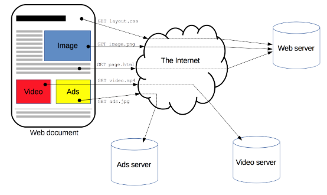
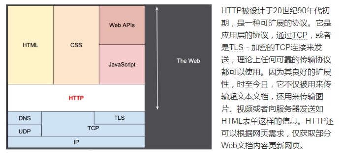
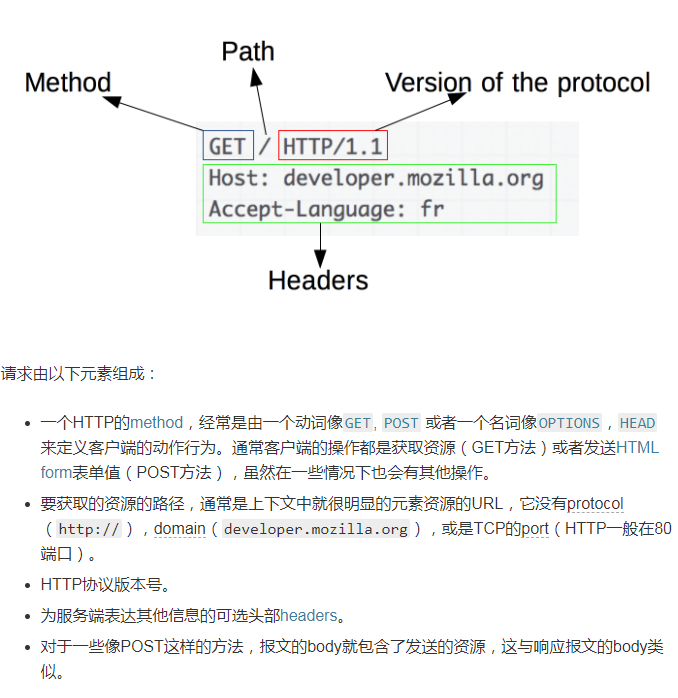
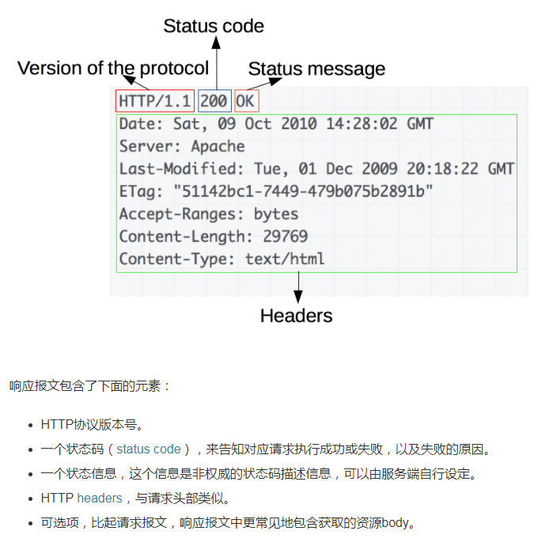
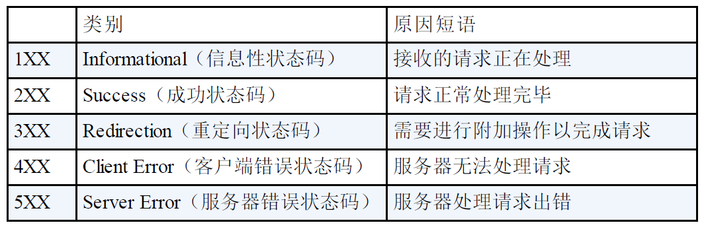

HTTP
=====

## 版本说明

```txt
1.0 广泛使用
1.1 修正版本(扩展了一些请求方法)
2.0 没有广泛使用
```





## URI和URL

```txt
两者的关系: URL是URI的子集
URI和URL都定义了资源是什么 但URL还定义了该如何访问资源
URL是一种具体的URI 它是URI的一个子集 它不仅唯一标识资源 而且还提供了定位该资源的信息
URI 是一种语义上的抽象概念 而URL则必须提供足够的信息来定位 是绝对的。

URL： Uniform Resource Locator
统一资源定位符
URI只是一种概念 怎样实现无所谓 只要它唯一标识一个资源就可以了

URI: Uniform Resource Identifier
统一资源标识符
表示的是web上每一种可用的资源，如 HTML文档、图像、视频片段、程序等都由一个URI进行定位的
```

## URI example

```txt
ftp://ftp.is.co.za/rfc/rfc1808.txt
http://www.ietf.org/rfc/rfc2396.txt
ldap://[2001:db8::7]/c=GB?objectClass?one
mailto:John.Doe@example.com
news:comp.infosystems.www.servers.unix
tel:+1-816-555-1212
telnet://192.0.2.16:80/
urn:oasis:names:specification:docbook:dtd:xml:4.1.2
```

## http头

- 通用的头部字段
- 请求的头部字段
- 响应的头部字段
- 实体的头部字段

## http请求方法





## http返回码



## http的cookie 缓存 连接管理

- cookie

```txt
Cookie 会根据从服务器端发送的响应报文内的一个叫做 Set-Cookie 的
首部字段信息 通知客户端保存 Cookie 当下次客户端再往该服务器
发送请求时 客户端会自动在请求报文中加入 Cookie 值后发送出
去
```

- cookie和session

```txt
http协议是无状态的 所以服务器无法知道是谁在浏览网页
但一些网页需要知道用户的状态例如登陆 购物车等。

相同点：
Session和Cookie都是为了让http协议有状态而存在
Session通过Cookie工作 Cookie传输的SessionID让Session知道这个客户端到底是谁

不同点：
Session将信息保存到服务器 Cookie将信息保存在客户端
```

- 连接管理

```txt
1.1版本之前 连接都不是持久化的 每次http请求 都需要一次TCP的握手/挥手
1.1版本之后 由于实现了连接的持久化 所以管线化请求变得可能 即不用等待上
次请求的响应返回 就可以发出下一条请求
```

## http报文

```txt
项目当中需要观察下 指的是什么

实际传输过程中会被压缩 分割
```
