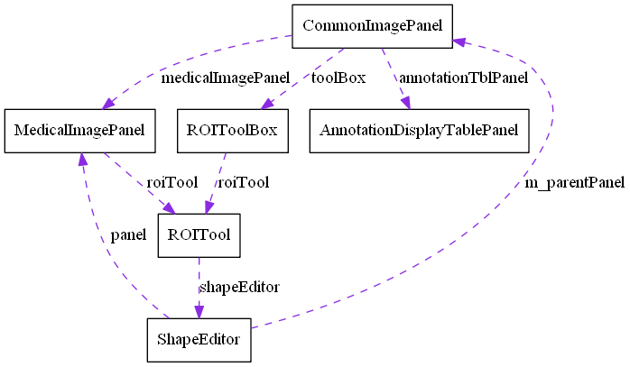
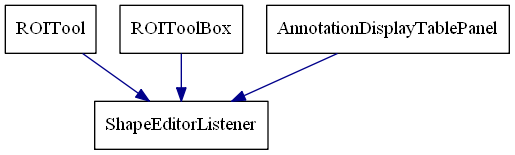

ImagePanel
==========

## 相关的文件

```txt
CommonImagePanel
MedicalImagePanel
ROITool
ROIToolBox
ShapeEditor
AnnotationDisplayTablePanel
```

## 协作图 <br>


### ShapeEditor

##### 说明
* shapeEditor是事件的发布者
* ROITool, ROIToolBox, AnnotationDisplayTablePanel是事件的监听者
* 通过addShapeEditorListener添加监听对象

#### ShapeEditorListener


#### 该接口实现了5个函数

* shapeAdded
* shapeRemoved
* shapeSelected
* shapeChanged
* shapeUnselected

#### 事件是何时发布的(运行时 不考虑初始化)

* shapeSelected
